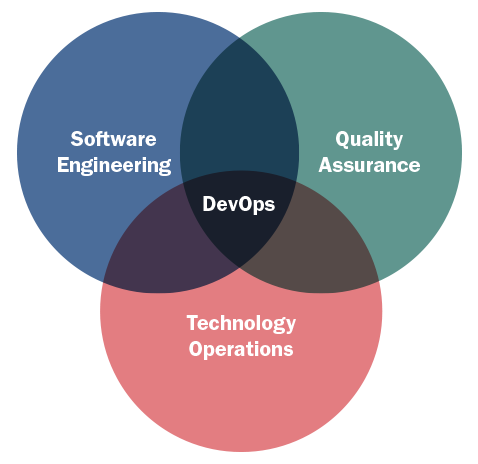

```{r setup, include=FALSE}
knitr::opts_chunk$set(echo = FALSE)
```

## Platform Introduction


[Source](https://unimooc.com/big-data-una-ventaja-para-las-pymes/)

## Welcome

Welcome to the BEEVA graduates program, it's nice to have you here!

* Feel free to make any question at any time
* Take a nice place and enjoy the session
* Who is the instructor?

## Jorge Alcaraz

* Head of technology at BEEVA
* Passionate about technology, software, data, arts and the web
* Sometimes actor and photographer
Twitter: [jorge_raze](https://twitter.com/jorge_raze) GitHub: [razeone](https://github.com/razeone)

## Agenda

| Topic                                                                   | Time     | Day   |
|-------------------------------------------------------------------------|----------|-------|
| Overview of the Data Platform                                           | 9 - 13   | 1-mar |
| Common infrastucture & DevOps features                                  | 15 - 18  | 1-mar |
| Data Storage                                                            | 9 - 13   | 2-mar |
| Data Integration                                                        | 15  - 18 | 2-mar |
| Data Processing                                                         | 9 - 13   | 3-mar |
| Data Analysis                                                           | 15 - 18  | 3-mar |
| Interface within BBVA context (DaaS,DBaaS, processing, analytics, IaaS) | 9 - 13   | 6-mar |
| Typical use case samples                                                | 15 - 18  | 6-mar |

## Motivation

##### Errors using inadequate data are much less than those using no data at all. ~ Charles Babbage


## Possible network troubleshooting

```
vim /etc/wpa_supplicant.conf

# paste
network={
         ssid="wifi_name"
         psk="wifi_key"
}

ip link set wlan0 down
ip link set wlan0 up
wpa_supplicant -B -iwlan0 -c/etc/wpa_supplicant.conf -Dwext
sudo dhclient wlan0
```


## Let's get our tools

```
yum -y groups install "GNOME Desktop" 
yum -y install git vim curl
startx
```


## What is data?

Data is a collection of facts, such as numbers, words, measurements, observations or even just descriptions of things. [source](https://www.mathsisfun.com/data/data.html)


## What is science?

Science is the concerted human effort to understand, or to understand better, the history of the natural world and how the natural world works, with observable physical evidence as the basis of that understanding. [source](http://www.gly.uga.edu/railsback/1122science2.html#WHATISSCIENCE)

## What is a data scientist?


## Seems legit


## Break

```{python, echo = T}

def you_need(something):
    for i in something:
        print(i)
        
    print('\n')
    return
    
        # if i is 'k':
        #   print('\n')
        #    break
        # if i == 'k':
        #   print('\n')
        #   break
        
my_break = 'break'
my_break1 = 'brkeak'

you_need(my_break)
you_need(my_break1)

```

## Break

```{python, echo = T}
def you_need(something):
    for i in something:
        print(i)
        if i == 'k':
            print('\n')
            break
        
my_break = 'break'
my_break1 = 'brkeak'

you_need(my_break)
you_need(my_break1)
```


## Seriouslly, what is Data Science?

* We’ll say that a data scientist is someone who extracts insights from messy data. Today’s world is full of people trying to turn data into insight. [1]
* Data science, also known as data-driven science, is an interdisciplinary field about scientific methods, processes and systems to extract knowledge or insights from data in various forms, either structured or unstructured,[1][2] similar to Knowledge Discovery in Databases (KDD). [2]

[1] Joel Grus. (2015). Data Science From Scratch. United States of America: O'Reilly Media.
[2] Wikipedia. (2017). Data Science. 2017-Feb-27, de Wikipedia Sitio web: https://en.wikipedia.org/wiki/Data_science

## What are the skills of a data scientist


## Some reading

* [Data Scientist: The Sexiest Job of the 21st Century](https://hbr.org/2012/10/data-scientist-the-sexiest-job-of-the-21st-century)
* [Big data: The next frontier for innovation, competition, and productivity](http://www.mckinsey.com/business-functions/digital-mckinsey/our-insights/big-data-the-next-frontier-for-innovation)
* [Building data science teams](http://radar.oreilly.com/2011/09/building-data-science-teams.html)
* [The Data Science Handbook](http://www.thedatasciencehandbook.com/)
* [How to actually learn data science](http://www.dataquest.io/blog/learn-data-science/)

## Data science jobs


[Source](http://radar.oreilly.com/2011/09/building-data-science-teams.html)


## Data looks great

* [A Visual Introduction to Machine Learning](http://www.r2d3.us/visual-intro-to-machine-learning-part-1/)
* [The Fallen of World War II](http://www.fallen.io/ww2/)
* [Tweetping](https://tweetping.net/)
* [Top mentioned books in stackoverflow.com](http://www.dev-books.com/)
* [GitHub Report Card](https://githubreportcard.reflect.io/)

## What can I solve with Data?

Google is tracking my location data in almost every moment, can I visualize it?


## Data looks great


## Really Google?


## Overview of the Data Platform
### Introducing Big Data

Big data is a term that describes the large volume of data – both structured and unstructured – that inundates a business on a day-to-day basis. But it’s not the amount of data that’s important. It’s what organizations do with the data that matters. Big data can be analyzed for insights that lead to better decisions and strategic business moves. 

* **Volume**. Organizations collect data from a variety of sources, including business transactions, social media and information from sensor or machine-to-machine data. In the past, storing it would’ve been a problem – but new technologies (such as Hadoop) have eased the burden.

* **Velocity**. Data streams in at an unprecedented speed and must be dealt with in a timely manner. RFID tags, sensors and smart metering are driving the need to deal with torrents of data in near-real time.

* **Variety**. Data comes in all types of formats – from structured, numeric data in traditional databases to unstructured text documents, email, video, audio, stock ticker data and financial transactions.

At SAS, we consider two additional dimensions when it comes to big data:

* **Variability**. In addition to the increasing velocities and varieties of data, data flows can be highly inconsistent with periodic peaks. Is something trending in social media? Daily, seasonal and event-triggered peak data loads can be challenging to manage. Even more so with unstructured data.

* **Complexity**. Today's data comes from multiple sources, which makes it difficult to link, match, cleanse and transform data across systems. However, it’s necessary to connect and correlate relationships, hierarchies and multiple data linkages or your data can quickly spiral out of control. [1]

[1]  SAS. (2017). Big Data What it is and why it matters. 2017-Feb-27, de SAS Sitio web: https://www.sas.com/en_us/insights/big-data/what-is-big-data.html

## Google Trends for Big Data


[Source](https://trends.google.com/trends/explore?q=big%20data)

## Magic Quadrant for Business Intelligence and Analytics Platforms


[Source](http://www.jenunderwood.com/2017/02/22/2017-gartner-bi-magic-quadrant-results/)

## How data comes to me?

* Continuous (is measured)
* Discrete (is counted)
* Ordinal 
* Categorical
* Missing
* Censored (real time)

## What about tidy data?

http://vita.had.co.nz/papers/tidy-data.pdf


## Go Eat


## Common infrastucture & DevOps features



## What is DevOps?

Basically infrastructure as code with agile practices plus steroids.

## Features

* Committing code frequently.
* Categorizing developer tests.
* Using a dedicated integration build machine.
* Using continuous feedback mechanisms.
* Staging builds.

[Source](http://searchsoftwarequality.techtarget.com/definition/continuous-integration)

## DevOps Stack


## Where are the steroids?

* Continuous Integration with Jenkins, Bamboo or Travis 
* Configuration with Chef, Pupet, Vagrant, Ansible
* Logging with Ganglia, Splunk, Flume, Nagios or New Relic

## DevOps Team Patterns


## Clone this Repo

```
git clone https://gitlab.beeva.mx/raze/data-graduates.git
```

