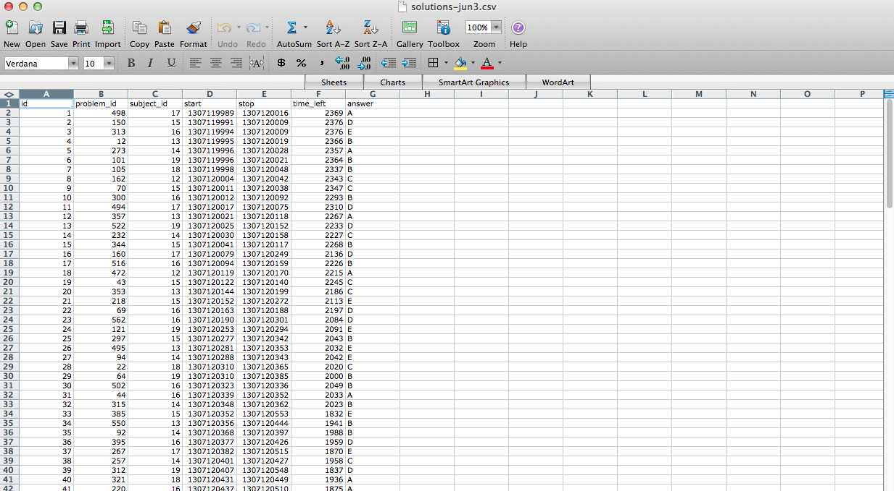
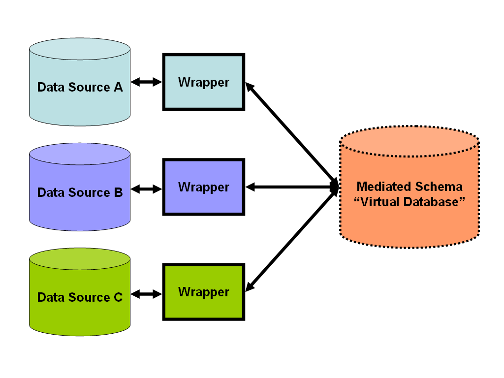

## Data Storage 

Definition:

Computer data storage, often called storage or memory, is a technology consisting of computer components and recording media used to retain digital data. It is a core function and fundamental component of computers.

[Source: Wikipedia](https://en.wikipedia.org/wiki/Computer_data_storage)


## What you wish data looked like



## How actually look like


## How actually look like


## Raw vs Processed Data


Raw data

* The original source of the data
* Often hard to use for data analyses
* Data analysis includes processing
* Raw data may only need to be processed once

http://en.wikipedia.org/wiki/Raw_data

Processed data

* Data that is ready for analysis
* Processing can include merging, subsetting, transforming, etc.
* There may be standards for processing
* All steps should be recorded

http://en.wikipedia.org/wiki/Computer_data_processing

## Components of Tidy Data

* The raw data.
* A tidy data set
* A code book describing each variable and its values in the tidy data set.
* An explicit and exact recipe you used to go from 1 -> 2,3.

## The raw data

* The strange binary file your measurement machine spits out
* The unformatted Excel file with 10 worksheets the company you contracted with sent you
* The complicated JSON data you got from scraping the Twitter API
* The hand-entered numbers you collected looking through a microscope

*You know the raw data is in the right format if you*

* Ran no software on the data
* Did not manipulate any of the numbers in the data
* You did not remove any data from the data set
* You did not summarize the data in any way

## The Tidy Data

* Each variable you measure should be in one column
* Each different observation of that variable should be in a different row
* There should be one table for each "kind" of variable
* If you have multiple tables, they should include a column in the table that allows them to be linked

*Some other important tips*

* Include a row at the top of each file with variable names.
* Make variable names human readable AgeAtDiagnosis instead of AgeDx
* In general data should be saved in one file per table.

https://github.com/jtleek/datasharing

## The code book

* Information about the variables (including units!) in the data set not contained in the tidy data
* Information about the summary choices you made
* Information about the experimental study design you used

*Some other important tips*

* A common format for this document is a Word/text file.
* There should be a section called "Study design" that has a thorough description of how you collected the data.
* There must be a section called "Code book" that describes each variable and its units.

## The Instructions List

* Ideally a computer script (in R :-), but I suppose Python is ok too...)
* The input for the script is the raw data
* The output is the processed, tidy data
* There are no parameters to the script
* In some cases it will not be possible to script every step. In that case you should provide instructions like:

* Step 1 - take the raw file, run version 3.1.2 of summarize software with parameters a=1, b=2, c=3
* Step 2 - run the software separately for each sample
* Step 3 - take column three of outputfile.out for each sample and that is the corresponding row in the output data set

## Types of Data Storage

* SAN
* NAS 
* DAS
* NFS
* Local disks
* Flexible disk
* Optical disk
* SSD

## SAN


## NAS


## DAS


## NFS


## SSD vs HDD


## Data formats/files

* CSV
* Excel
* JSON
* XML
* HDF5
* MySQL
* Reading from the web
* Reading from APIs

## Data Frames with Python

```{bash, eval = FALSE}
virtualenv -p python3.5 env
source env/bin/activate
pip install pandas requests lxml
python
```


```{python, eval = FALSE}
import pandas as pd

df = pd.DataFrame({ 'A' : 1.,
                    'B' : pd.Timestamp('20130102'),
                    'C' : pd.Series(1, index=list(range(4)), dtype='float32'),
                    'D' : pd.Series([1, 2, 1, 2], dtype='int32'),
                    'E' : pd.Categorical(["test", "train", "test", "train"]),
                    'F' : 'foo' })
df
df.B
# Compute the sum of D for each category in E
df.groupby('E').sum().D
```


## Download a file

```{python, eval = FALSE}
import urllib.request
url = "http://spatialkeydocs.s3.amazonaws.com/FL_insurance_sample.csv.zip"
file_name = "data/downloaded.zip"
# Download the file from `url` and save it locally under `file_name`:
urllib.request.urlretrieve(url, file_name)
```

## Unzip a file

```{python, eval = FALSE}
import zipfile
path_to_zip_file = "data/downloaded.zip"
directory_to_extract_to = "data"
zip_ref = zipfile.ZipFile(path_to_zip_file, 'r')
zip_ref.extractall(directory_to_extract_to)
zip_ref.close()
```

## Reading a CSV file

```{python, eval = FALSE}
import csv
f = open('data/FL_insurance_sample.csv')
csv_f = csv.reader(f)

for row in csv_f:
  print(row)
```

## Reading a JSON with Python

```{python, eval = FALSE}
import requests
r = requests.get(url='https://api.github.com/users/razeone/repos')
print(r.json())
```

## Web Scrapping

```{python, eval = FALSE}
from lxml import html
import requests

page = requests.get('https://www.beeva.com/en/')
tree = html.fromstring(page.content)

title = buyers = tree.xpath('//title/text()')
```


## Data Integration

Data integration involves combining data residing in different sources and providing users with a unified view of these data.[1] This process becomes significant in a variety of situations, which include both commercial (when two similar companies need to merge their databases) and scientific (combining research results from different bioinformatics repositories, for example) domains. Data integration appears with increasing frequency as the volume and the need to share existing data explodes.[2] It has become the focus of extensive theoretical work, and numerous open problems remain unsolved.

[Source: Wikipedia](https://en.wikipedia.org/wiki/Data_integration)

## Data Integration Pattern


## Formal Framework

A **data integration system** *I* is a triple <*G, S, M*>, where

* G is the global schema (Over an alphabet *A~G*)

## ETL

#### Extract Transform and Load


## Common Data Integration Common Solution



## Data Integration Solutions

[Data Integration and Application Integration Solutions Directory](https://solutionsreview.com/data-integration/data-integration-solutions-directory/)

## Connecting to PostgreSQL

```{python, eval = FALSE}
>>> import psycopg2

# Connect to an existing database
>>> conn = psycopg2.connect("dbname=test user=postgres")

# Open a cursor to perform database operations
>>> cur = conn.cursor()

# Execute a command: this creates a new table
>>> cur.execute("CREATE TABLE test (id serial PRIMARY KEY, num integer, data varchar);")

# Pass data to fill a query placeholders and let Psycopg perform
# the correct conversion (no more SQL injections!)
>>> cur.execute("INSERT INTO test (num, data) VALUES (%s, %s)",
...      (100, "abc'def"))

# Query the database and obtain data as Python objects
>>> cur.execute("SELECT * FROM test;")
>>> cur.fetchone()
(1, 100, "abc'def")

# Make the changes to the database persistent
>>> conn.commit()

# Close communication with the database
>>> cur.close()
>>> conn.close()
```

## Quiz

> http://bit.ly/2munCQO