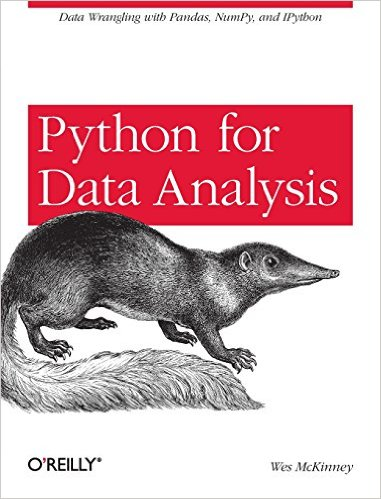

```{r setup, include=FALSE}
knitr::opts_chunk$set(echo = FALSE)
```

## Python

Python is a widely used high-level programming language for general-purpose programming, created by Guido van Rossum and first released in 1991. An interpreted language, Python has a design philosophy which emphasizes code readability (notably using whitespace indentation to delimit code blocks rather than curly braces or keywords), and a syntax which allows programmers to express concepts in fewer lines of code than possible in languages such as C++ or Java. The language provides constructs intended to enable writing clear programs on both a small and large scale.[24]

Python features a dynamic type system and automatic memory management and supports multiple programming paradigms, including object-oriented, imperative, functional programming, and procedural styles. It has a large and comprehensive standard library.

[Source: Wikipedia](https://en.wikipedia.org/wiki/Python_(programming_language))

## Bibliography



## IDEs

* Eclipse with PyDev Plugin
* Python Tools for Visual Studio (for Windows users)
* PyCharm
* Spyder
* Komodo IDE

* I like to use SublimeText3 with Anaconda

## Import conventions

```{python, eval = FALSE}
import numpy as np
import pandas as pd
import matplotlib.pyplot as plt
```

